# farman

Qt6 / C++20 製のクロスプラットフォーム 2 画面ファイラ。
キーボードのみで全ての操作を完結できる、使い勝手の良いファイラを目指してます。

## 主な機能

- **2 ペイン UI** + シングルペイン / **プレビューモード (Quick View)** の 3 レイアウト切替
- **サムネイル表示**: リスト / 小・中・大の 4 段階 (`Cmd/Ctrl+1〜4`)。画像 / PDF 1 ページ目に対応
- **ディレクトリ比較**: 左右ペインの差分を行ごとに色分け
- **同期ブラウズ**: 片方のペインを移動するともう片方も相対追従
- **キー駆動**操作: `c`/`m`/`k`/`d`/`r`/`n`/`a`/`f`/`p`/`u` 等の単一キーで主要操作
- **ファイル操作**: コピー / 移動 / 削除 (ゴミ箱 or 完全削除) / リネーム /
  **一括リネーム** (テンプレート + 連番 + 正規表現置換 + プレビュー)
- **再帰検索**: バックグラウンド再帰検索、結果からの直接ジャンプ
- **ブックマーク**, **ディレクトリ履歴** (永続化可)
- **アーカイブ** (libarchive)
  - 作成・展開: zip / tar / tar.gz / tar.bz2 / tar.xz
  - **アーカイブ内ブラウジング** (仮想 FS `archive.zip!/inner/`) と選択抽出
  - **作成オプション**: 圧縮レベル + zip の **AES-256 パスワード暗号化**
  - 暗号化 zip の展開 (パスワード入力 + 検証)
- **組み込みビュアー** (インライン / 別ウィンドウ両対応、全文検索付き):
  - テキスト (エンコード自動判定 / 行番号 / ワードラップ)
  - 画像 (ズーム / Fit / 透明背景 Checker / GIF・WebP アニメ / **90° 回転** /
    **Info ダイアログ** (Exif / ICC プロファイル / DPI) / BMP / **PSD 合成プレビュー**)
  - バイナリ (16 進ダンプ + アドレス列・文字列列カラーリング)
  - **Markdown** (CommonMark + GFM / 表 / タスクリスト / 全文検索)
  - **PDF** (Qt PDF / ページ送り / ズーム / Fit / 全文検索)
  - **CSV・TSV** (区切り自動判定 / セル検索 / 巨大ファイル遅延ロード)
- **任意ビュアーで開く** (Ctrl+Enter) / **OS 既定アプリで実行** (Shift+Enter)
- **外部ビュアープラグイン**: ユーザー指定ディレクトリから
  `IViewerPlugin` (`.dylib` / `.so` / `.dll`) を起動時ロード
- **自動アップデート**: 起動時に新版チェック → ワンクリックでダウンロード + SHA256 検証 + インストール
- **設定エクスポート/インポート**: ブックマーク / カスタムコマンド / カラースキーム含む全設定を 1 ファイルで他マシンへ移行
- **ログペイン** (日次ローテーション + 保持日数設定)
- **アドレスバー / カーソル / カテゴリ別ファイル色 / 行高** などの外観カスタマイズ
- **キーバインドの完全カスタマイズ** + デフォルトリセット
- **国際化**: 英語 / 日本語 (Auto は OS 設定に追従)
- **外部変更の自動反映**: Finder などからファイルを増減すると即座に追随

## スクリーンショット

### ファイル操作・表示モード

| | |
|---|---|
| 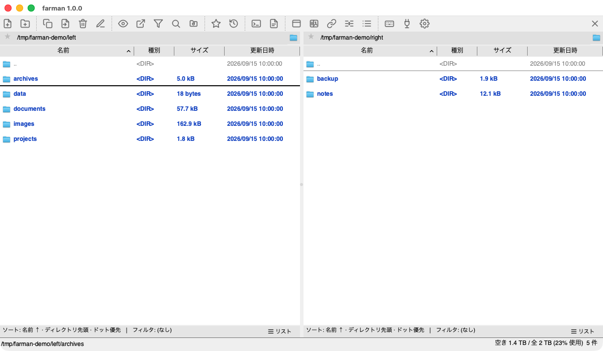 | 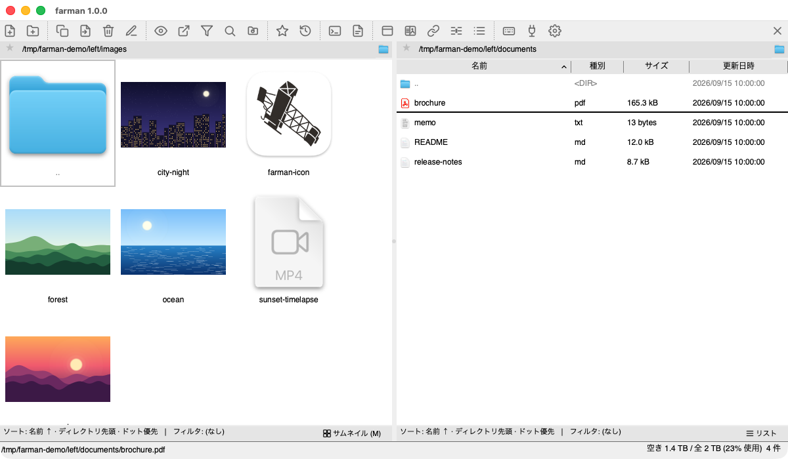 |
| メイン 2 ペイン | サムネイル表示 |
| 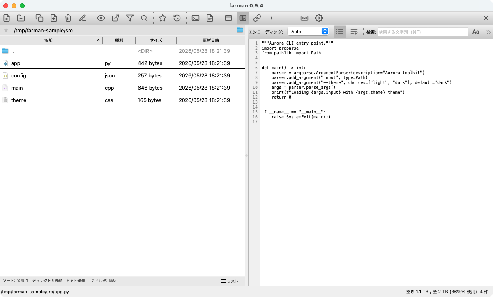 | 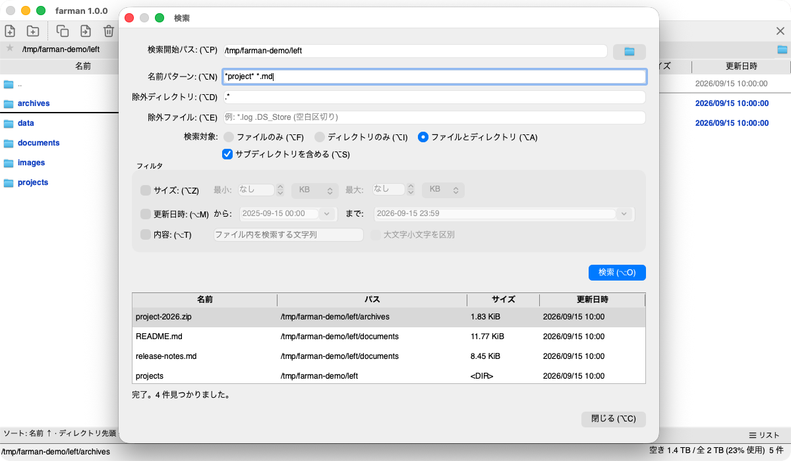 |
| プレビューモード (Quick View) | 再帰検索 |
| 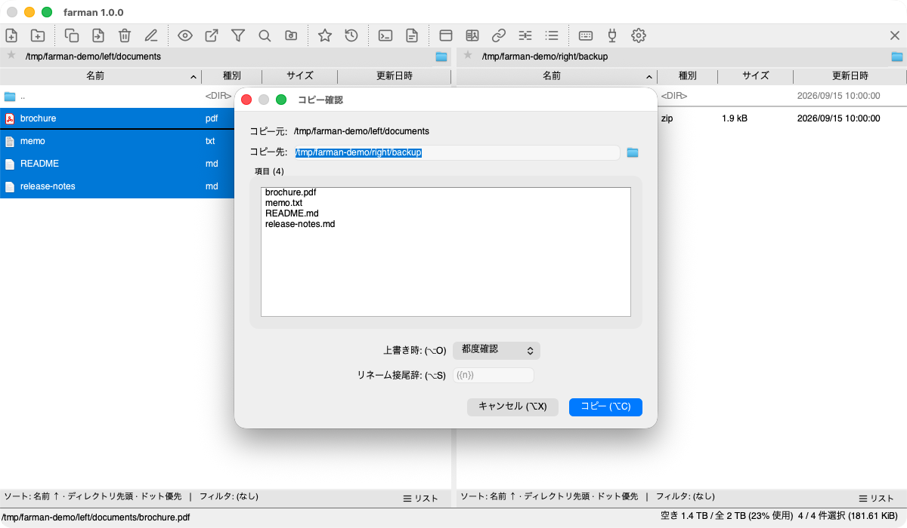 | 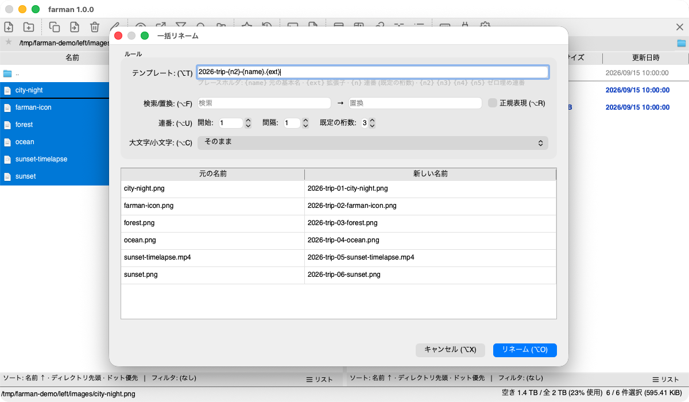 |
| コピー / 移動確認 | 一括リネーム (プレビュー付き) |
| 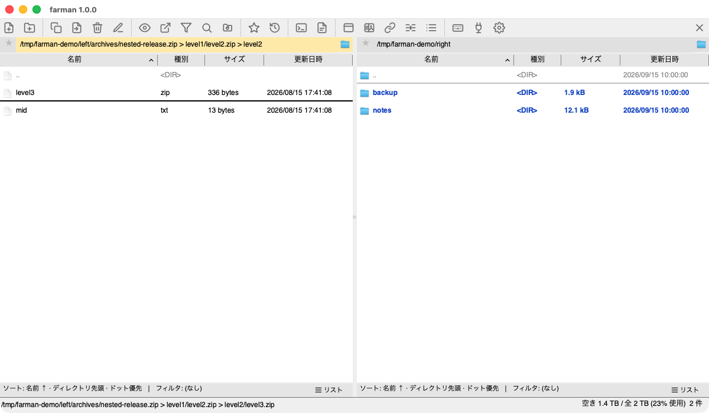 | 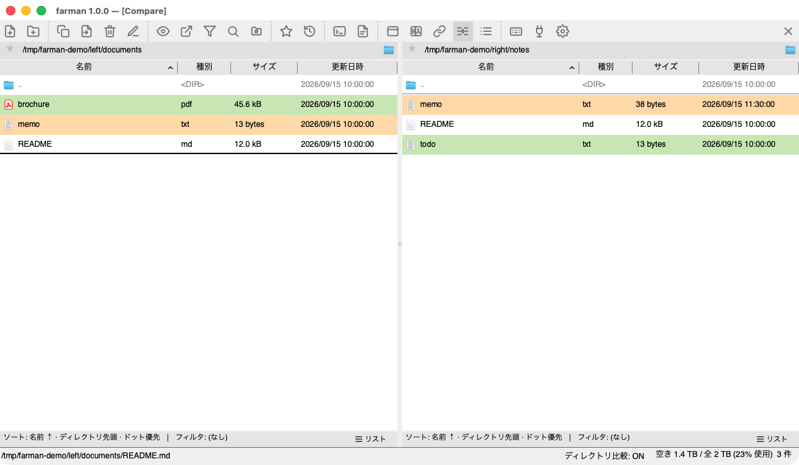 |
| アーカイブブラウジング (仮想 FS) | ディレクトリ比較 |
| 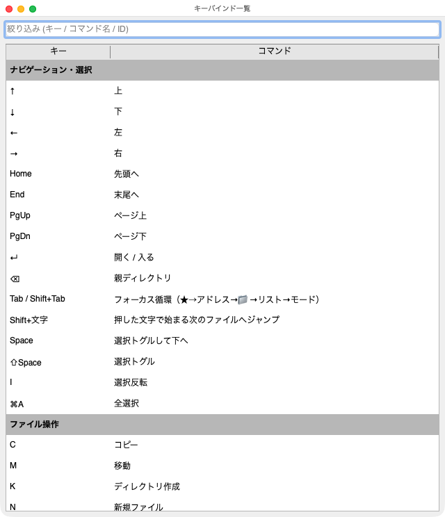 |  |
| ショートカット一覧 | 設定 |

### 組み込みビュアー

| | |
|---|---|
| 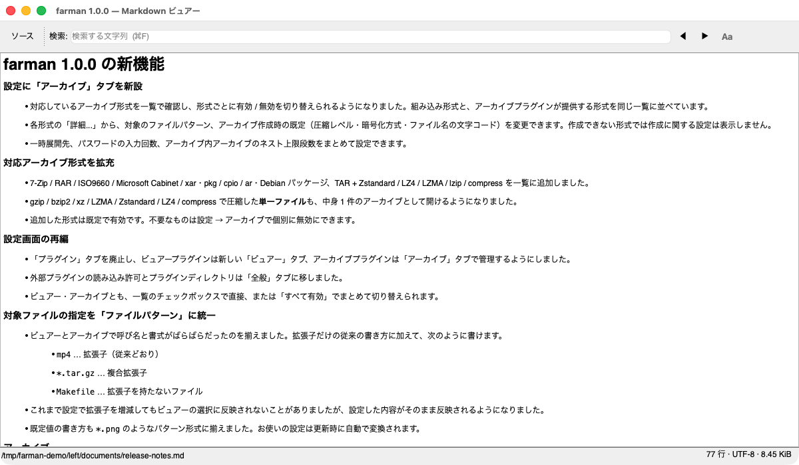 | 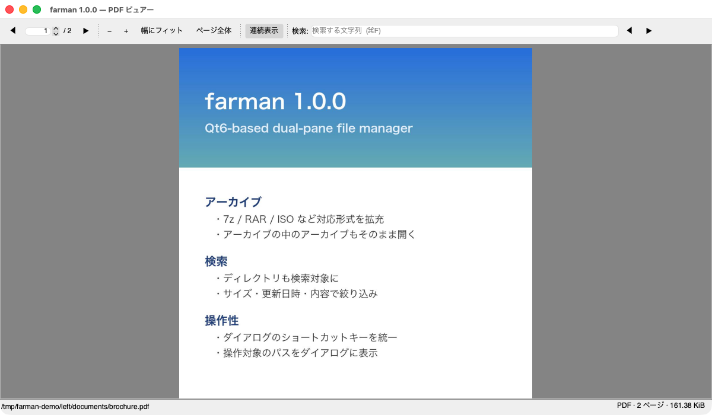 |
| Markdown (CommonMark + GFM) | PDF (Qt PDF / 全文検索) |
| 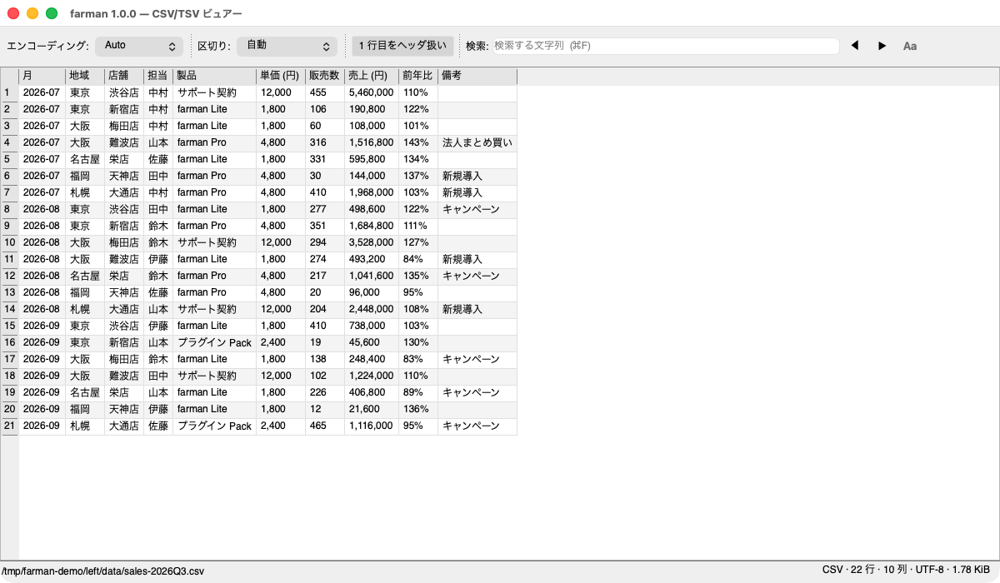 | 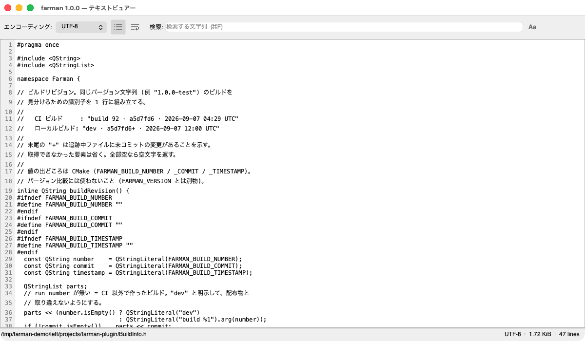 |
| CSV / TSV (区切り自動判定 / セル検索) | テキスト (エンコード自動判定) |
| 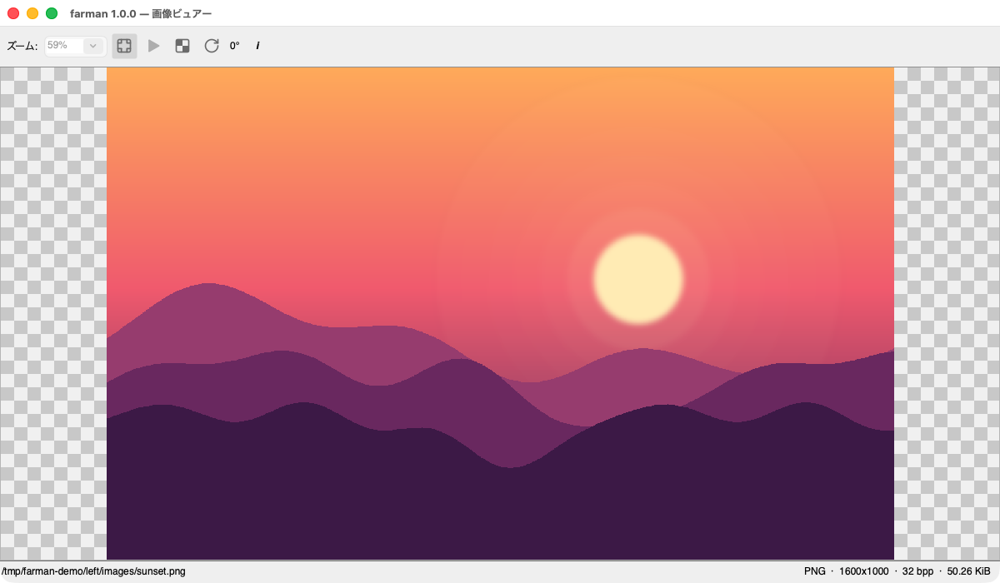 | 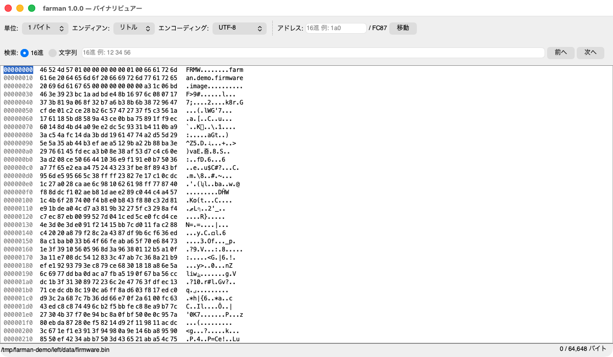 |
| 画像 (ズーム / Fit / Exif) | バイナリ (16 進ダンプ) |

## 動作環境

- **macOS** 12 (Monterey) 以降 / Apple Silicon (M1/M2/M3/M4)
  - 配布 DMG は arm64 専用。Intel Mac で動かしたい場合はリポジトリを
    clone して各自ローカルビルドで対応 (CMakeLists.txt は Intel
    Homebrew prefix `/usr/local` も検索する)。
- **Windows** 10 / 11 (x64)
- **Linux** Qt 6 が動く X11 / Wayland 環境 (Ubuntu 22.04 以降で動作確認)

## バイナリの入手

公開済みの最新版は **GitHub Releases** から入手できます:

<https://github.com/mashsoft-jp/farman/releases/latest>

エンドユーザー向けの配布サイト (OS を自動判定してダウンロードボタンを生成)
も `docs/` 配下に同梱しています (GitHub Pages 配信、URL は別途案内)。

| OS | 配布形式 |
|---|---|
| macOS (Apple Silicon, arm64) | `farman-vX.Y.Z-macos-arm64.dmg` |
| Windows (x64) | `farman-vX.Y.Z-windows-x64-setup.exe` (Inno Setup) + `farman-vX.Y.Z-windows-x64.zip` (ポータブル) |
| Linux (x86_64) | `farman-vX.Y.Z-linux-x86_64.AppImage` + `farman-vX.Y.Z-linux-x86_64.deb` |

各アセットには `.sha256` チェックサムが付属します。

> **macOS**: v0.9.5 以降は **Apple Developer ID 署名 + 公証 (Notarization)
> 済み**で配布しています。`.dmg` をマウントして `farman.app` を `/Applications`
> にドラッグするだけで、Gatekeeper 警告なしで起動できます。
>
> **Windows**: 現状 **Authenticode 未署名**です。署名対応は配布数の
> 推移を見て検討します (第一候補は Azure Trusted Signing)。

## デフォルトキーバインド (抜粋)

| キー | 動作 |
|---|---|
| `↑` / `↓` / `Home` / `End` / `PageUp` / `PageDown` | カーソル移動 |
| `←` / `→` | ペイン端で親ディレクトリ / 反対ペインへ |
| `Tab` / `Shift+Tab` | アクティブペイン内のフォーカス循環 (★ → アドレス → 📁 → リスト → モード)。Dual 表示時は端で対向ペインへ、Preview 表示時はプレビューペインへ |
| `Enter` | ディレクトリへ入る / ビュアーで開く |
| `Backspace` | 親ディレクトリへ |
| `Space` / `Shift+Space` | 選択トグル (移動あり / なし) |
| `Shift+文字` | 頭文字でカーソルジャンプ (ドットファイルは 2 文字目もマッチ) |
| `c`/`m`/`d`/`r`/`k`/`n` | コピー / 移動 / 削除 / リネーム / 新規ディレクトリ / 新規ファイル |
| `Ctrl+R` | 一括リネーム |
| `Ctrl+C` | カーソル行のパスをクリップボードへコピー |
| `f` | ファイル検索 |
| `p` / `u` | アーカイブ作成 / 展開 |
| `v` | ビュアーで開く |
| `Ctrl+Enter` | 任意のビュアーで開く |
| `Shift+Enter` | OS 既定アプリで実行 |
| `b` / `Ctrl+B` | ブックマーク登録/解除 / 一覧 |
| `h` | ディレクトリ履歴 |
| `s` | ソート・フィルタ設定 (このディレクトリ専用にも保存可) |
| `Ctrl+L` | ログペイン表示切替 |
| `Ctrl+Right` / `Ctrl+Left` | ペインのディレクトリを反対側に同期 |
| `Ctrl+,` | 設定 |
| `Ctrl+Q` | 終了 |

すべて設定の「キーバインド」で変更可能。

## 設定の保存場所

| OS | パス |
|---|---|
| macOS | `~/Library/Preferences/Farman/farman/settings.json` |
| Linux | `~/.config/Farman/farman/settings.json` |
| Windows | `%APPDATA%\Farman\farman\settings.json` |

ログ既定値: 同ディレクトリ下 `farman-YYYY-MM-DD.log` (Settings から変更可)

## ドキュメント

- [BUILD.md](BUILD.md) — ソースからのビルド手順、CI / リリースの運用、翻訳 (i18n)
- [SPEC.md](SPEC.md) — 機能仕様書
- [ARCHITECTURE.md](ARCHITECTURE.md) — コード構成
- [SIGNING.md](SIGNING.md) — macOS コード署名 (Developer ID + 公証) のセットアップ手順
- [CLAUDE.md](CLAUDE.md) — Claude Code 用のガイダンス

## ライセンス

[MIT License](LICENSE) — Copyright (c) Mashsoft Inc.

## 依存ライブラリ / 謝辞

farman は以下のオープンソースソフトウェアを利用しています。各ライブラリのライセンスは
それぞれの上流に従います。

| ライブラリ | 用途 | ライセンス |
|---|---|---|
| [Qt 6](https://www.qt.io/) (Core / Widgets / Core5Compat / LinguistTools) | UI フレームワーク | LGPL v3 |
| [libarchive](https://www.libarchive.org/) | アーカイブ作成・展開 (zip / tar / gz / bz2 / xz) | New BSD |
| [uchardet](https://www.freedesktop.org/wiki/Software/uchardet/) | テキストエンコード自動判定 | MPL 1.1 (Mozilla Public License 1.1) |

すべて動的リンクで利用しています。各ライブラリのライセンス通知は次の 2 経路で提供します。

- **アプリ内**: メニュー → Help → About farman... → **License Info...** で全文を表示
- **配布物に同梱**:
  - macOS `.dmg` … ウィンドウ内に `LICENSE.txt` / `THIRD-PARTY-LICENSES.txt`
  - Windows `.zip` / インストーラ … インストール先 (`{app}`) 直下に同梱
  - Linux AppImage / `.deb` … `/usr/share/doc/farman/`
